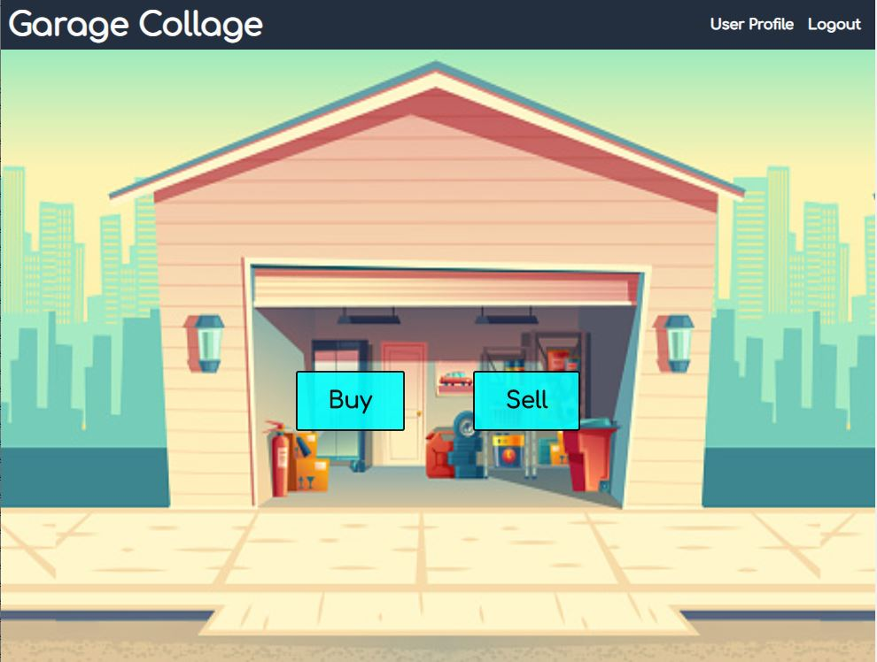
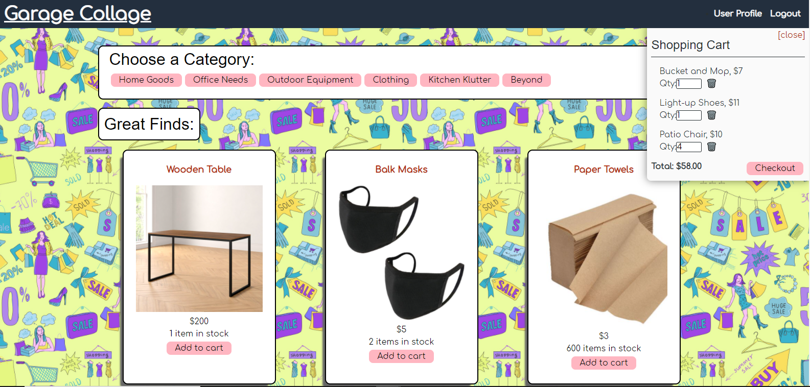
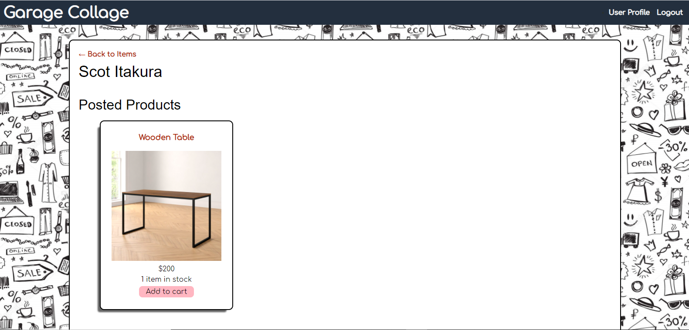

# Online/Offline e-commerce app: Garrage Collage

## Purpose
An e-commerce application catering to the needs of a recent/ frequent mover looking to buy/sell lightly used goods at a bargain. This platform is a virtual garage sale, allowing users from all over the capability to purchase and purge on a world-wide scale.

## Features
When the user loads the site, they are able to view a homepage with a functioning garage door revealing the options to buy or sell various products. 

When the user selects the buy option, they are presented with a collage of items that they can add to the shopping cart OR navigate to a desired category to view the products within that designation. When adding to the shopping cart, the cart will open and display the options to edit the quantity or checkout. Upon checkout, the user is redirected to a Stripe payment page to enter their information. The user is notified of successful payment completion and redirected back to the site to continue shopping! 

When the user selects the sell option, they are presented with an input form to add their product's, name, description, price, photo and other details. When the user submits the listing, they are they redirected to the main product page where they will see their newly posted product.

The user is able to track their activity by navigating to the User Profile page where they will see their posted and purchased items!

## Built With
* React JS
* JavaScript
* Apollo
* GraphQL
* Heroku
* Node JS 
* NoSQL - MongoDB
* Express
* Mongoose
* Concurrently

## Usage
To run program: `node server`.  From the homepage the user may choose to sign-in or create an account if he/she has not already registered an account.  If the user chooses to not sign-in they may still browse the inventory of goods, however, they will need to sign-in to post any items for sale or purchase any items in their cart.

### Shop
The user will find all the available items to buy on this page and they may filter their search by selecting a category at the top of the page.  The user may, also, click on an item to view additional product information and view a list of similar products.  Add any product to the cart by clicking the `Add to Cart` button or remove an item by clicking the `Remove from Cart` button.

### Sell An Item
To post an item for sale, be sure to have signed into a registered account and then click on the `Sell` tab in the navigation bar at the top of the page.  The user will be redirected to a form where they can input the information of the item they wish to put up for sale.  Once, they have submitted their form with the necessary information they will be sent to a redirect page where they may choose to put another item up for sale or return to the shop page.

### User's Page
This page contains the logged in user's information and any past order history of the user.

## Deployed Application

https://garage-collage-2468.herokuapp.com/

## Project Status
Garage Collage is complete in adherence with acceptance criteria

## Contribution
Created by Sara Hu, Scot Itakura, and Jennifer Mulder
